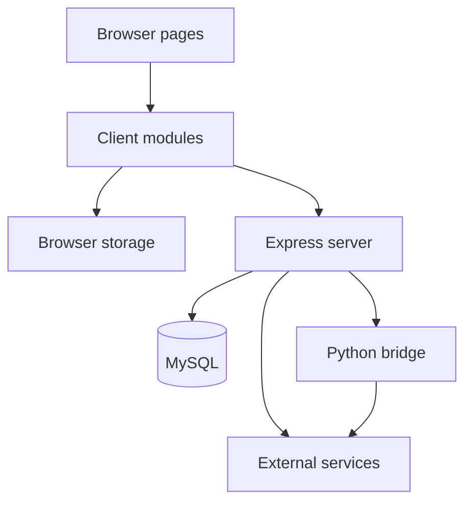
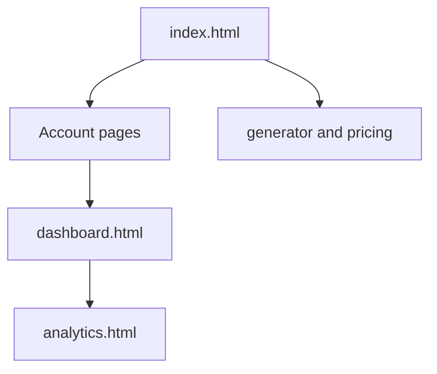
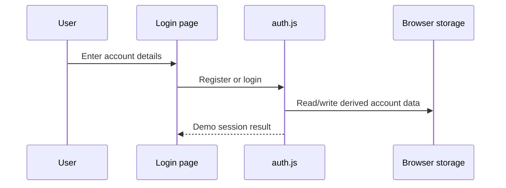
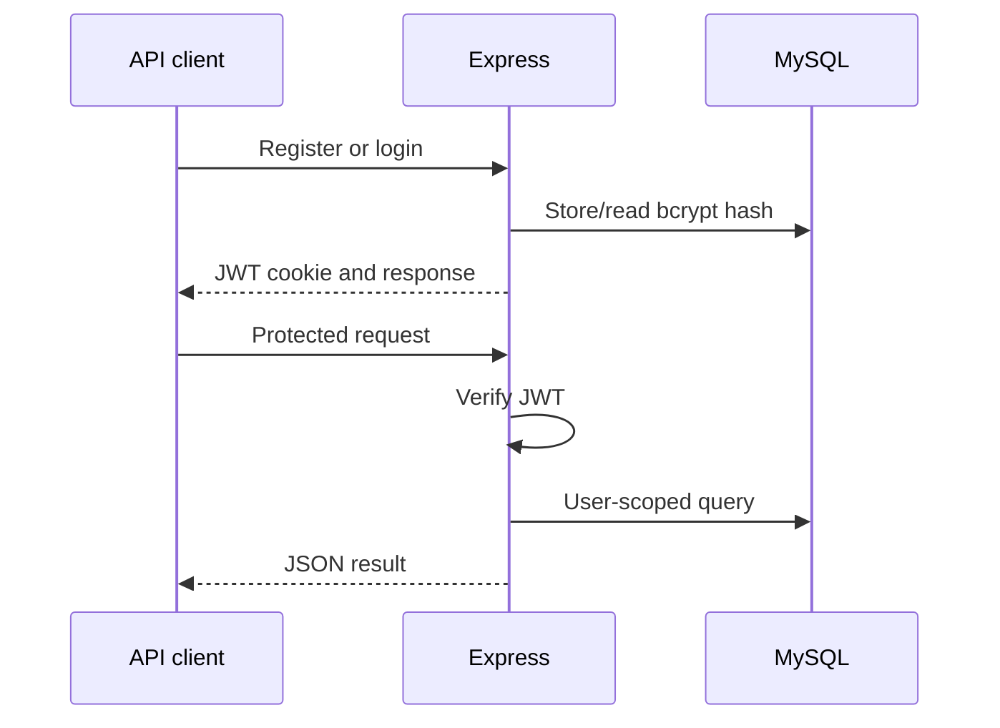
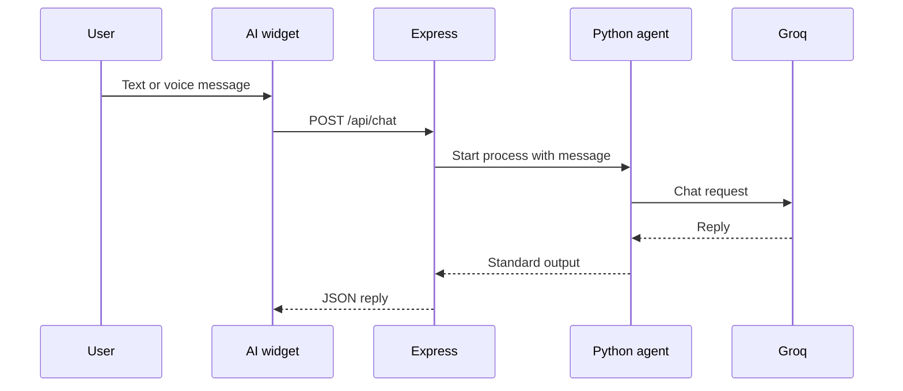
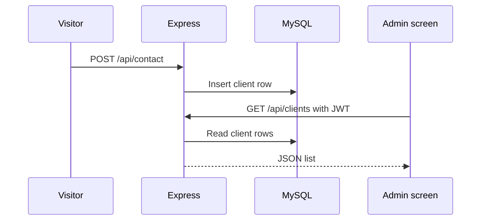
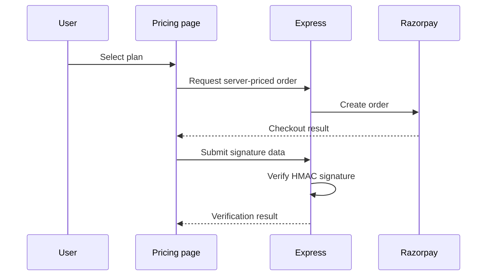

# System Architecture

## Overview

Limitless Fitness uses a multi-page browser frontend, an Express API, MySQL persistence, optional Python processing, and external AI/payment services.

## Component responsibilities

| Component | Responsibility |
| --- | --- |
| HTML pages | Page structure, forms, dashboards, charts, and navigation |
| Shared CSS | Theme tokens, common layout, responsive design, and page styling |
| Browser JavaScript | Demo authentication, local workout state, charts, planning, animation, AI widget, and voice |
| Express server | Static hosting, validation, REST APIs, JWT checks, MySQL access, AI routing, and payment verification |
| MySQL | Server users, contact submissions, payments, and workout records |
| Python modules | Optional AI bridge and analytics aggregation |
| AI providers | Generated chat responses |
| Razorpay | Checkout order and payment response |

## Frontend architecture

The application is a set of HTML entry points rather than a single-page framework.

Shared assets are organized under `styles/`, `js/`, and `images/`. Several pages also contain page-specific inline CSS and JavaScript.

## Authentication architecture

Two independent systems exist in the current development build.

### Browser-demo flow

- Used by the visible signup, login and dashboard screens. Password recovery is disabled pending ownership verification.
- Password data is derived with PBKDF2 and a random salt.
- Account records are in `localStorage`.
- Session data is in `sessionStorage`.
- Suitable for classroom demonstration, not production identity management.

### Server API flow

- Implemented by `/api/auth/*` and `authenticateToken` in `server.js`.
- Uses bcrypt password hashing and a seven-day JWT.
- Accepts the JWT through the HTTP-only cookie or `Authorization: Bearer` header.
- Not yet connected to the visible account pages.

## Workout data architecture

Three separate storage paths exist for workout data:

| Path | Used by | Storage |
| --- | --- | --- |
| Dashboard path | `dashboard.html` | `__lf_workout_log__`: object grouped by date |
| Analytics path | `analytics.html`; written by the unlinked `js/workspace.js` | `limitless_workouts`: array |
| Server path | `/api/workouts/*`, `/api/dashboard/analytics` | MySQL `workout_logs` |

They do not synchronize. The current dashboard does not populate the analytics page. Both browser keys are shared across accounts in the same browser profile. Integration should use one user-scoped source and preserve existing records during migration.

## Embedded AI flow

- `PYTHON_BIN` selects the Python executable.
- The child process starts with a fixed script path, no shell, and a timeout.
- `GROQ_API_KEY` is read by the Python process from its environment.

## Standalone streaming AI flow

The standalone page under `public/` posts to `/api/chat/stream`. Express calls the configured primary provider directly and forwards generated tokens as Server-Sent Events. If both keys are configured, the route attempts the other provider after a primary-provider error.

## Contact and admin flow

Current warning: a valid JWT is required, but a separate administrator role is not checked.

## Payment flow

The visible pricing flow performs signature verification. Connecting that verified result to an authenticated user subscription remains pending.

## Trust boundaries

- Browser input is untrusted and must be validated server-side.
- Browser storage is controlled by the local user and is not authoritative.
- `.env` secrets must stay on the server.
- Payment prices must come from the server map, not from the browser.
- AI output is untrusted generated content and should be displayed as text, not inserted as raw HTML.
- MySQL queries should remain parameterized.
