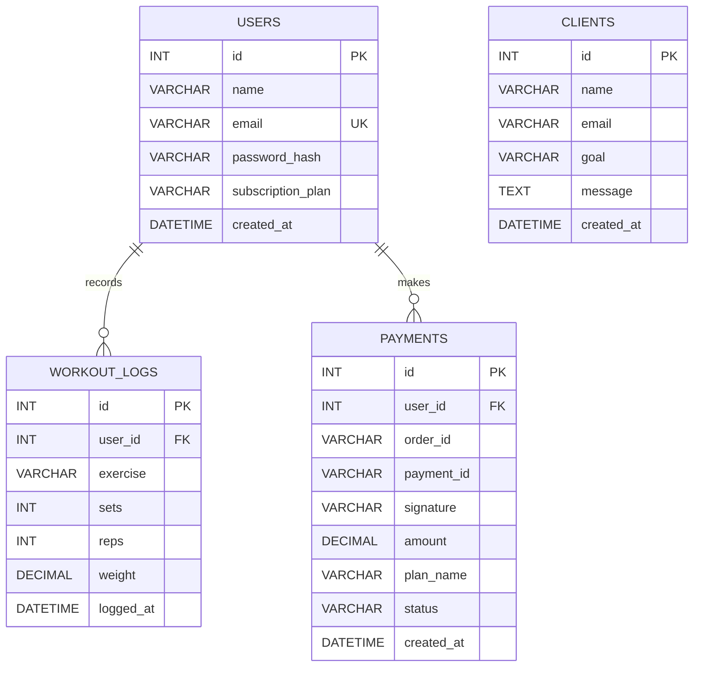

# Database Design

## Active database engine

The active Express server uses **MySQL** through `mysql2/promise`. The canonical development schema is `backend/database.sql`.

Default database name:

```text
limitless_fitness
```

## Entity relationship



## Tables

### `users`

Stores server-authenticated accounts.

| Column | Type | Rules |
| --- | --- | --- |
| `id` | `INT` | Primary key, auto-increment |
| `name` | `VARCHAR(255)` | Required |
| `email` | `VARCHAR(255)` | Required, unique |
| `password_hash` | `VARCHAR(255)` | Required bcrypt hash |
| `subscription_plan` | `VARCHAR(50)` | Defaults to `free` |
| `created_at` | `DATETIME` | Defaults to current timestamp |

### `workout_logs`

Stores user-scoped server workout records.

| Column | Type | Rules |
| --- | --- | --- |
| `id` | `INT` | Primary key, auto-increment |
| `user_id` | `INT` | Foreign key to `users.id` |
| `exercise` | `VARCHAR(255)` | Required |
| `sets` | `INT` | Required |
| `reps` | `INT` | Required |
| `weight` | `DECIMAL(5,2)` | Required; API accepts 0 for bodyweight entries |
| `logged_at` | `DATETIME` | Defaults to current timestamp |

Deleting a user deletes their server workout rows through `ON DELETE CASCADE`.

### `payments`

Stores records created by the authenticated payment verification route.

| Column | Type | Rules |
| --- | --- | --- |
| `id` | `INT` | Primary key, auto-increment |
| `user_id` | `INT` | Foreign key to `users.id` |
| `order_id` | `VARCHAR(255)` | Razorpay order identifier |
| `payment_id` | `VARCHAR(255)` | Razorpay payment identifier |
| `signature` | `VARCHAR(255)` | Verification signature |
| `amount` | `DECIMAL(10,2)` | Recorded amount |
| `plan_name` | `VARCHAR(100)` | Selected plan |
| `status` | `VARCHAR(50)` | Defaults to `success` |
| `created_at` | `DATETIME` | Defaults to current timestamp |

Deleting a user deletes their payment rows through `ON DELETE CASCADE`.

### `clients`

Stores public contact-form submissions. Email is unique in this table, so a second submission with the same email returns 409.

| Column | Type | Rules |
| --- | --- | --- |
| `id` | `INT` | Primary key, auto-increment |
| `name` | `VARCHAR(255)` | Required |
| `email` | `VARCHAR(255)` | Required |
| `goal` | `VARCHAR(255)` | Defaults to `general` |
| `message` | `TEXT` | Required |
| `created_at` | `DATETIME` | Defaults to current timestamp |

## Initialization

```bash
mysql -u root -p < backend/database.sql
```

The server's `initDB()` also creates the database and core tables when permissions allow. The SQL file mirrors its column definitions and constraints. `CREATE TABLE IF NOT EXISTS` does not migrate an existing table. Review existing schema differences before using either setup path.

## Environment configuration

```dotenv
DB_HOST=localhost
DB_PORT=3306
DB_USER=root
DB_PASSWORD=your_password
DB_NAME=limitless_fitness
```

## Browser storage is separate

The visible browser-demo flow does not use these tables:

| Browser key | Purpose |
| --- | --- |
| `__lf_users_v2__` | Derived browser-demo account records |
| `__lf_session__` | Current tab session |
| `__lf_workout_log__` | Dashboard entries grouped by date; shared across browser accounts |
| `limitless_workouts` | Separate analytics array; written by the unlinked workspace module |
| `limitless_theme` | Theme preference |

Browser storage is not a server database. It stays on one browser profile and can be cleared by the user. The two workout keys are not synchronized or isolated by account.

## Backup example

```bash
mysqldump -u root -p limitless_fitness > limitless_fitness_backup.sql
```

Do not commit backups containing real user information.

## Production recommendations

- Use a database account with access only to this application database.
- Require encrypted database connections when the provider supports them.
- Store credentials only in the host's secret manager/environment settings.
- Apply schema migrations instead of relying on startup `ALTER TABLE` statements.
- Add data-retention, export, and deletion workflows.
- Encrypt backups and restrict access.
