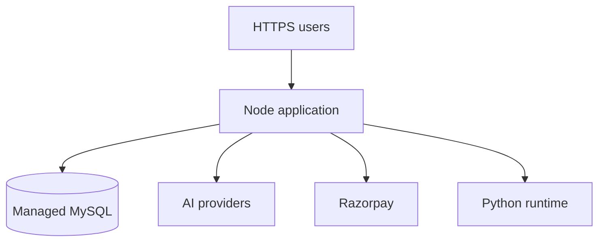

# Deployment Guide

## Important hosting requirement

The complete project needs a host that can run:

- A long-running Node.js process
- Environment variables/secrets
- Outbound HTTPS requests for configured providers
- A MySQL connection
- Python, if `/api/chat` is enabled

GitHub Pages can host only static frontend files. It cannot run `server.js`, MySQL, AI proxy routes, contact persistence, protected APIs, or payment verification.

## Production architecture



## Before deployment

- [ ] Resolve every item under `README.md` → Known limitations.
- [ ] Unify browser and server authentication.
- [ ] Add role-based admin authorization.
- [ ] Consolidate the payment routes and persist verified subscriptions safely.
- [ ] Add automated API and browser tests.
- [ ] Add security headers, CSRF protection, and route-specific rate limits.
- [ ] Review all health-related copy with qualified professionals and add age-appropriate controls.
- [ ] Confirm privacy policy, terms, consent, data deletion, and retention requirements.
- [ ] Remove demo testimonials, claims, contact details, and placeholder values that are not verified.

## Build and start commands

Install:

```bash
npm ci --omit=dev
python3 -m pip install -r requirements.txt
```

Start:

```bash
npm start
```

The service must bind to the host-provided `PORT`. `server.js` already reads `process.env.PORT`.

## Required environment variables

```dotenv
NODE_ENV=production
PORT=5000
FRONTEND_URL=https://your-domain.example

DB_HOST=
DB_PORT=3306
DB_USER=
DB_PASSWORD=
DB_NAME=limitless_fitness

JWT_SECRET=
PRIMARY_AI=groq
GROQ_API_KEY=
CLAUDE_API_KEY=
PYTHON_BIN=python3

RAZORPAY_KEY_ID=
RAZORPAY_KEY_SECRET=
```

Set only the provider keys actually used. Store every secret in the hosting platform's protected environment settings.

## Database preparation

1. Create a MySQL database and restricted application account.
2. Require TLS when available.
3. Run `backend/database.sql` against the production database.
4. Back up the database before schema changes.
5. Test migration and rollback procedures in staging.

Do not grant the application account global MySQL administrator privileges.

## HTTPS and cookies

With `NODE_ENV=production`, the auth cookie uses `secure: true`, so the public site must use HTTPS. Keep the frontend and API on the same origin when possible. If they are on different origins, review CORS, cookie `SameSite`, CSRF, and credential settings together.

## Python route

The embedded `/api/chat` route starts `fuaak_agent.py`. On Linux, set:

```dotenv
PYTHON_BIN=python3
```

If the host does not support Python child processes, disable/remove the embedded route or replace it with a Node-only server implementation before deployment. The standalone `/api/chat/stream` route calls providers directly from Node.

## Health check

Configure the hosting health probe to request:

```text
GET /api/health
```

The current health route confirms that Express is running and reports AI-key configuration. Add an internal MySQL readiness check before relying on it for production orchestration.

## Payment safety

- Start with Razorpay test mode.
- Confirm that order amounts originate from the server price map.
- Verify every signature server-side.
- Link successful verification to an authenticated user.
- Make payment writes idempotent so a callback cannot create duplicates.
- Verify payment state with the provider before granting access.
- Never log payment secrets or full sensitive payment payloads.

## Post-deployment checks

- [ ] Home and static assets load over HTTPS.
- [ ] No secret appears in page source or browser JavaScript.
- [ ] Database connection succeeds.
- [ ] CORS accepts the real origin and rejects an unknown origin.
- [ ] Auth cookies are secure and HTTP-only.
- [ ] Unauthorized admin/API requests are rejected.
- [ ] AI failure returns a safe error without exposing internals.
- [ ] Payment test flow passes and invalid signatures fail.
- [ ] Logs do not contain passwords, tokens, private messages, or secrets.
- [ ] Backup and restore are tested.

## Rollback

Keep the previous working application release and a compatible database backup. If verification fails, route traffic back to the previous release and restore data only through a reviewed recovery procedure.

