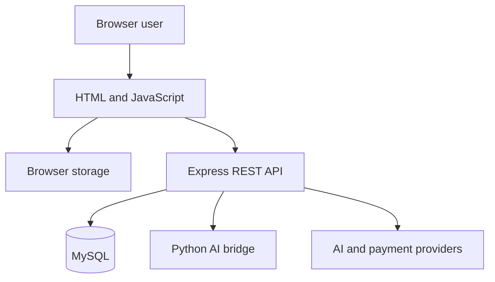

# Limitless Fitness — Project Report

## 1. Project title

**Limitless Fitness: Full-Stack Fitness and Wellness Web Platform**

## 2. Abstract

Limitless Fitness is a multi-page web project for recording workouts and presenting fitness-related information. The pages use HTML, CSS and JavaScript. Node.js and Express serve the files and provide APIs for accounts, contact messages and workout records. MySQL stores the server data. Two chat interfaces use external AI services, with a Python process handling one of the request paths.

The current version has separate browser and server implementations of some features. For example, signing in through the page creates a local browser session, not the JWT used by protected APIs. This report describes those differences so the project can be explained and improved without claiming unfinished integrations are complete.

## 3. Problem statement

Fitness information is often split across workout pages, tracking tools, meal-planning tools, and separate chat applications. The project explores how these functions can be presented through one consistent web interface while preserving a modular structure for future development.

## 4. Objectives

- Build a responsive fitness and wellness website.
- Provide structured workout and exercise information.
- Demonstrate account registration, login and logout; identify the work required for verified password recovery.
- Allow users to record workouts and view activity summaries.
- Generate general wellness and training suggestions.
- Provide multilingual AI chat and optional voice interaction.
- Store contact and application data in MySQL through REST APIs.
- Demonstrate payment order creation and signature verification.
- Keep secrets outside source control through environment variables.
- Supply complete setup, API, database, testing, deployment, and GitHub documentation.

## 5. Scope

The current scope includes a browser-based interface, a Node.js backend, a MySQL schema, optional Python processing, and third-party AI/payment integrations. Native Android, iOS, and Windows applications are outside the current repository. The project is educational and does not replace professional medical or health advice.

## 6. Users and roles

| Role | Intended capabilities | Current status |
| --- | --- | --- |
| Visitor | Browse content, exercises, programmes, pricing, BMI screen, and contact form | Implemented |
| Browser-demo user | Register, sign in, use dashboard, save local logs, and open analytics | Implemented in browser storage |
| API user | Use MySQL/JWT authentication and protected REST endpoints | Backend implemented; frontend integration pending |
| Administrator | Review contact submissions | Screen and protected API exist; role authorization pending |

## 7. Functional modules

### 7.1 Landing and content module

`index.html` presents navigation, feature sections, workout information, food content, exercise filters, a BMI interface, testimonials, pricing links, newsletter UI, and the contact form.

### 7.2 Authentication module

`signup.html`, `login.html` and `js/auth.js` implement the browser-demo account flow. Passwords are derived with PBKDF2 and a random salt before storage. The session is stored in `sessionStorage` and expires after eight hours. Password recovery is disabled until account ownership can be verified; the screen reports that limitation without changing credentials.

The Express API separately provides bcrypt/JWT registration and login backed by MySQL. This second flow is designed for eventual production integration.

### 7.3 Dashboard module

`dashboard.html` displays the signed-in user, a day-based routine, a workout-entry form, saved entries and a link to analytics. It keeps the most recent 90 date buckets, not necessarily 90 consecutive calendar days. Its local storage key is not scoped to a user, so accounts in the same browser share the local workout records.

### 7.4 Analytics module

`analytics.html` contains Chart.js views for an array stored under `limitless_workouts`. The current dashboard writes a different structure under `__lf_workout_log__`, so its new entries do not reach the charts. `analytics.py` and `/api/dashboard/analytics` provide two more aggregation implementations. The Python helper calculates load volume, whereas the API heatmap returns a set-based score; these outputs should not be treated as identical.

### 7.5 Plan-generation module

`js/diet-planner.js` contains the rule-based browser planner used by the dashboard. `generator.html` calls the protected `/api/generate-plan` endpoint for a separate server-generated plan. Outputs are general educational estimates and require professional review before real health use.

### 7.6 AI and voice module

The embedded widget in `js/ai-coach.js` sends text to `/api/chat`. The server starts `fuaak_agent.py`, which calls the Groq API. Browser speech recognition can capture a message and speech synthesis can read the answer.

The standalone `public/` interface uses `/api/chat/stream`. That endpoint supports configured Groq or Anthropic providers and returns Server-Sent Events. The standalone UI includes language selection and browser voice controls.

### 7.7 Contact and administration module

The home-page contact form posts to `/api/contact`, which validates and stores the submission in MySQL. `admin.html` displays records returned by `/api/clients`.

### 7.8 Payment module

`pricing.html` opens Razorpay Checkout. The server creates orders using server-controlled prices and verifies the returned signature with HMAC-SHA256. Test credentials must be used during development.

## 8. Non-functional requirements

- Responsive layout for desktop and mobile browsers
- Clear navigation and reusable visual tokens
- Basic input validation and output escaping
- Environment-based secret management
- Parameterized MySQL queries
- Cross-platform Python command configuration
- Maintainable feature-specific files
- Documentation suitable for contributors and reviewers

## 9. System requirements

### Development hardware

No hardware benchmark was performed. The development computer must be able to run an editor, Node.js, a browser and MySQL together. Memory and disk requirements depend on the installed tools and database size.

### Development software

- Windows, macOS, or Linux
- VS Code or another editor
- Node.js 20+
- npm
- MySQL 8+
- Python 3.10+
- Modern Chrome, Edge, Firefox, or Safari browser

Voice recognition availability depends on browser support.

## 10. Methodology

1. Design independent frontend pages and shared visual styles.
2. Add browser modules for authentication, dashboard state, analytics, planning, animation, and AI UI.
3. Add an Express server for static hosting and REST APIs.
4. Add MySQL tables and parameterized database operations.
5. Connect optional AI and payment providers through server-held credentials.
6. Validate JavaScript and Python syntax.
7. Document configuration, APIs, database design, testing, deployment, security, and Git workflow.

## 11. Data flow summary

## 12. Security measures present

- Secrets loaded from `.env`, which is ignored by Git
- HTTP-only JWT cookie support in the server API
- bcrypt password hashing for MySQL users
- PBKDF2 password derivation for browser-demo accounts
- Parameterized MySQL queries
- CORS origin allowlist
- Payment signature verification
- Output escaping in several dynamic interfaces
- Python child process executed without a shell and with a timeout

Security limitations and required production work are listed in `SECURITY.md`.

## 13. Testing approach

The repository validator syntax-checks the JavaScript files. Python modules are compile-checked separately. Manual testing covers navigation, account screens, dashboard logging, analytics, APIs, MySQL persistence, AI configuration, responsive layout, and payment test mode. Automated browser and database integration tests remain future work.

## 14. Current result

The source contains the pages and routes described in this report. JavaScript syntax checks, Python compilation and isolated logic checks were completed. A live Express/MySQL run and a full browser demo were not verified because dependency downloads were unavailable in the review environment. AI and payment integrations also need configured test credentials before they can be demonstrated.

## 15. Limitations

- Browser and server authentication are separate implementations.
- Dashboard, analytics and MySQL use separate data sources; local workout keys are shared across browser accounts.
- Admin endpoints do not yet enforce a dedicated admin role.
- Server-backed password-reset email flow is not implemented.
- Payment verification and subscription persistence are not unified across the visible checkout flow.
- Automated end-to-end tests are not present.
- Health-related calculations are educational estimates and are not appropriate for medical decisions.

## 16. Future scope

- Unify the frontend with MySQL/JWT authentication.
- Move dashboard records from browser storage to user-isolated API storage.
- Add role-based admin authorization.
- Add token-based email verification and password reset.
- Persist verified subscriptions through one payment workflow.
- Add API, database, and browser automation tests.
- Add accessibility auditing and performance optimization.
- Add privacy controls for export and deletion of user data.
- Add professional review and age-appropriate safeguards for health content.

## 17. Conclusion

Limitless Fitness demonstrates how a multi-page frontend, REST backend, relational database, Python bridge, voice interface, AI providers, and payment gateway can be combined in one modular project. The codebase is suitable for demonstration and continued development. The documented integration and security gaps must be resolved before production launch.
