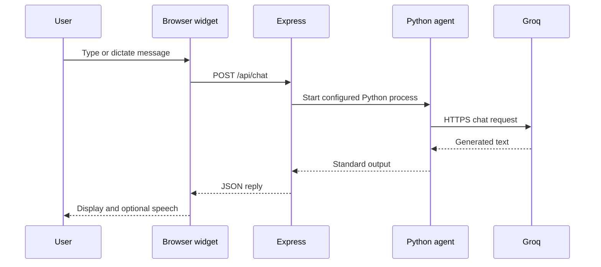
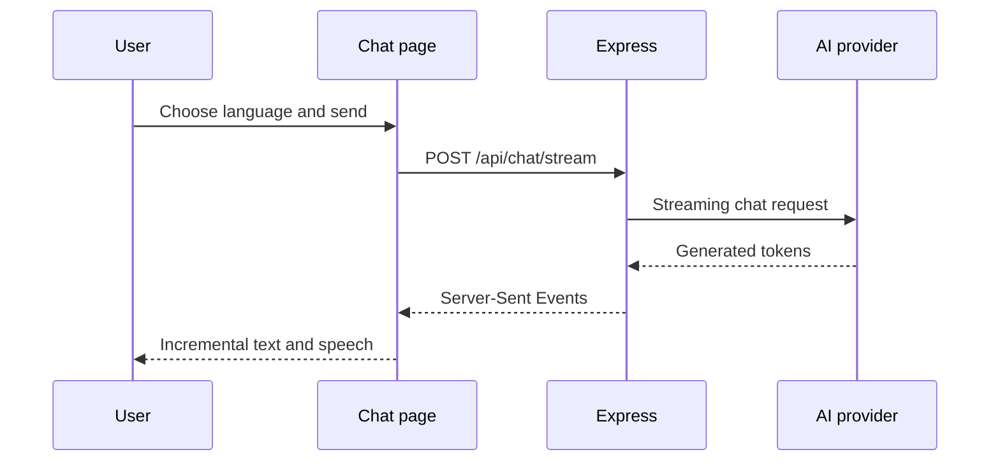

# AI Assistant and Voice Workflow

Limitless Fitness contains two AI interfaces. They share the Express server but use different request paths.

## 1. Embedded widget

Main files:

- `js/ai-coach.js`
- `server.js`
- `fuaak_agent.py`
- `openclaw_tools.py`
- `analytics.py`



### Browser step

The floating widget accepts typed text. When the browser supports Web Speech Recognition and the user grants microphone permission, it can also convert a spoken message to text. AI responses are inserted with `textContent`.

### Express step

`POST /api/chat` validates that `message` is a non-empty string no longer than 2,000 characters. It starts `fuaak_agent.py` with the configured `PYTHON_BIN`, the project directory as its working directory, no shell, and a 25-second timeout.

### Python step

`fuaak_agent.py` reads `GROQ_API_KEY` and calls the configured Groq model. When the message contains an analytics-related keyword, it can call `openclaw_tools.process_workout_logs()`. That wrapper passes JSON through standard input to `analytics.py`, uses the current Python interpreter, and enforces a 10-second timeout.

The current analytics context in `fuaak_agent.py` is sample data, not the signed-in user's MySQL records. Its sample field names also differ from those expected by `analytics.py`, so it must not be presented as meaningful personal workout statistics.

### Response and speech step

Express returns the Python standard output as `{ success, reply }`. The widget displays the text. When the request began through the microphone, browser Speech Synthesis can read the response aloud and resume listening while voice mode remains active.

## 2. Standalone multilingual chatbot

Main files:

- `public/index.html`
- `public/style.css`
- `public/chatbot.js`
- `server.js`



The request includes `message`, a language key, and recent chat history. Express selects the matching server prompt and calls the configured primary provider. If that provider fails and the other provider is configured, the server attempts the fallback. Tokens are returned as Server-Sent Events until `data: [DONE]`.

## Required configuration

```dotenv
PRIMARY_AI=groq
GROQ_API_KEY=
CLAUDE_API_KEY=
PYTHON_BIN=python
```

- The embedded `/api/chat` path currently requires Groq and Python.
- The streaming path uses `PRIMARY_AI` and can attempt the other configured provider as fallback.
- On many Linux hosts, use `PYTHON_BIN=python3`.

## Browser support

Text chat works in modern browsers. Voice input/output depends on the browser, installed voices, permission, secure context, language support, and operating system.

## Safety and privacy

- AI output can be inaccurate and is not medical advice.
- The client should not send secrets or private health information.
- The server must not log keys, tokens, or sensitive messages.
- Production routes should add rate limits, abuse controls, and a reviewed content-safety policy.
- Users under 18 should involve a parent/guardian and qualified professional for health decisions.
